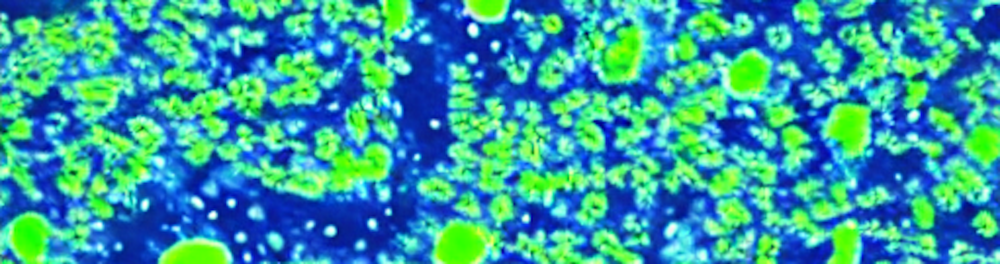
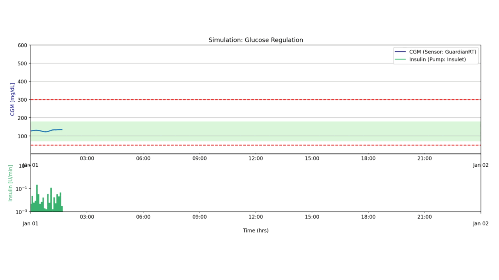
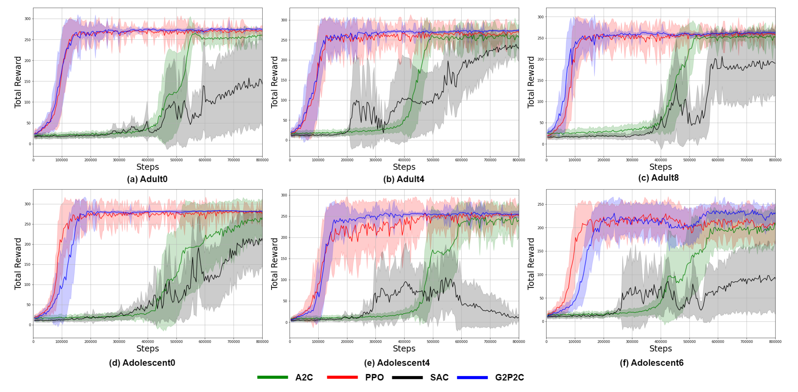
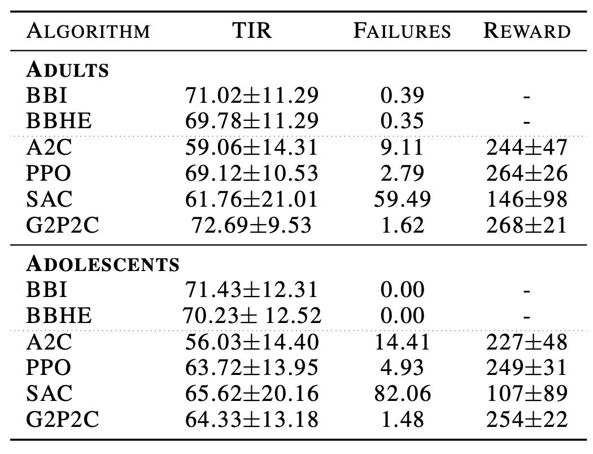
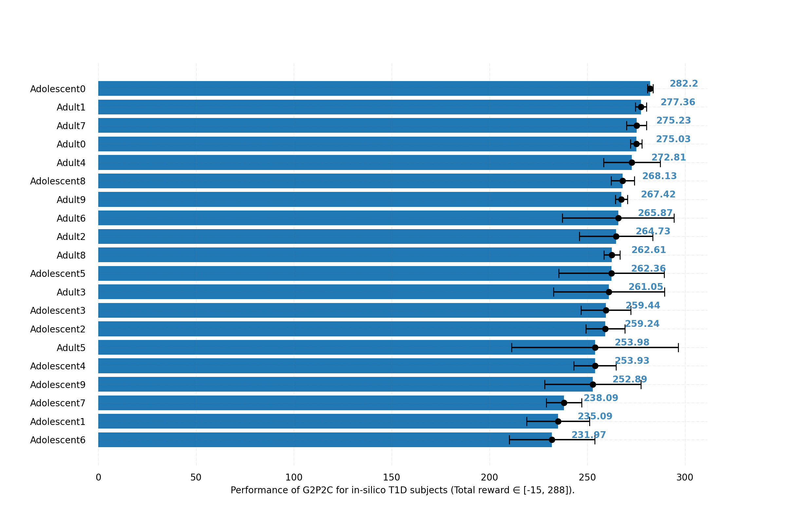
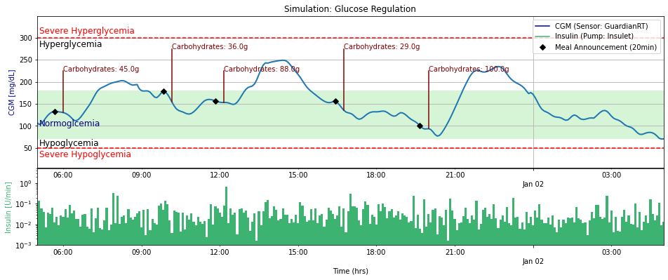

<h1>G2P2C: Reinforcement Learning based Artificial Pancreas Systems.</h1>


[](https://capsml.com/)
[](https://www.python.org/downloads/release/python-31012/)
[](https://github.com/chirathyh/G2P2C/actions/workflows/python-app.yml)
[](http://hdl.handle.net/1885/305591)

**G2P2C** is a project to develop Reinforcement Learning (RL)-based Artificial Pancreas Systems (APS), with the aim to automate treatment in Type 1 Diabetes (T1D). 

**Background:** Type 1 Diabetes (T1D) is casued by the autoimmune destruction of the islet beta-cells and results in absolute insulin deficiency (cover image: Human islet of Langerhans created by Stable Diffusion). Hence, external administration of insulin is required to maintain glucose levels, which is cruicial as both low and high glucose levels are detrimental to health. This is usually done through an insulin pump attached to the body. An continuous glucose sensor is also attached to measure the glucose levels so that a control algorithm can estimate the appropriate insulin dose. In this project we design Reinforcement Learning (RL) based Artificial Pancreas Systems (APS) for the glucose control problem. The figure below shows the main components of an APS. 

<p align="center">

</p>

Maintaining glucose levels is a life-long optimisation problem, complicated due to the disturbances associated with daily events (meals, exercise, stress.. etc), delays present in glucose sensing and insulin action, partial observability, and safety constraints among others. A simulation of glucose regulation, using a RL-based strategy is shown below, where the optimal glucose range is shaded in green severe hypoglycemia / hyperglycemia ranges highlighted by the red dotted line. The blood glucose measurements are presented in the top, while the administered insulin by the RL agent is presented in the bottom. The disturbances related to meal events and the carbohydrate content of the meals are presented in red.



 `Note: Existing classical control algorithms (PID, MPC) can successfully control glucose levels well when there is limited disturbances and uncertainty. However, during daily MEALS (a disturbance to the system) people with T1D have to be pro-active (to reduce uncertainty) and plan in advance (typically decide 20-minutes in advance what they will be having and manually estimate the amount of carbohydrates present in the meal). This adds a significant cognitive burden, and errors associated with the manual process (e.g., estimating carbs) leads to sub-optimal glucose regulation. Therefore, in this work the main aim is to fully automate treatment, where the RL algorithms are not given any information related to upcoming meal events or carb contents and tested against challenging meal protocols (e.g., meals with large CHO for large disturbances, simulate the real world with skipped meals). If these conditions are relaxed, existing methods perform very well.`

Example training curves of RL algorithms for selected in-silico subjects are presented below (the mean and standard deviation of the total reward achieved against environment steps for evaluation simulations are presented). The in-silico subjects can be considered as unique environments, Adolescent6 is the hardest to control while Adolescent0 is the easiest. Please refer publications below for detailed results and comparisons against standard clinical treatment approaches.  

<p align="center">

</p>

Performance comparison of clinical treatment strategies (BBI, BBHE: these require manual meal announcement and CHO estimation) and RL strategis (please find a comparison against other implementations of RL-based strategies in previous work in our [paper](https://www.sciencedirect.com/science/article/pii/S1746809423012727)). G2P2C achieved a better reward performance against other RL algorithms and comparable performance against clinical strategies in the adult in-silico cohort. 

<p align="center">

</p>

 `Note: For RL, each in-silico subject can be considered as a unique environment. It is important to test against the full cohorts of the in-silico population, due to their varying glucose dynamics which results in some subjects being very easy to control while some are much harder. The results of our best performing RL algorithm (G2P2C) against different subjects is presented below (the ranking of the difficulty was consistent across other RL algorithms as well, refer publications for detailed results). `

<p align="center">

</p>

 `Note: Additional resources released for researchers/developers:`
- You can find more details and an online-demonstration tool of our RL-based glucose control algorithms by visiting [**CAPSML**](https://capsml.com/).
- A high performance simulation environment which aims to facilitate the development of Reinforcement Learning based Artificial Pancreas Systems: [GluCoEnv](https://github.com/chirathyh/GluCoEnv).

Project Contributions
-- 
* We formulate the glucose regulation problem as a continuing continous control problem in an POMDP environemnt. We use the average reward RL setting and the Proximal Policy Optimisation (PPO) algorithm to develop a system which eliminates the requirement of carbohydrate estimation aiming to reduce the cognitive burden on people with T1D [[Paper]](https://ieeexplore.ieee.org/abstract/document/9871054) .<br>
* The control space (i.e., the insulin secretion rate) consists of very small doses of insulin known as basal insulin and larger doses called bolus insulin which is used to counter large glucose fluctuations. We propose a non-linear continuous action space, inspired by clinical treatment to overcome challenges (skewed action distribution / redundant actions) associated with the continuous action space which improves the performance and efficiency in learning  [[Paper]](https://link.springer.com/chapter/10.1007/978-3-031-22695-3_39) .<br>
* G2P2C: Glucose Control by Glucose Prediction and Planning, a deep reinforcement learning algorithm based on PPO, which introduced two auxiliary phases; model learning and planning. The model learning phase learns a glucose dynamics model while the planning phase fine-tunes the learnt policy to a short-horizon to counter the short-term fluctuations of glucose. The system eliminates the need for carbohydrate estimation and meal announcement [[Paper]](https://www.sciencedirect.com/science/article/pii/S1746809423012727). 

Using the project
--

<h4>Installation</h4>

* Create and activate a Python3.10.12 virtual environment.
* Clone the repository: <code>git clone git@github.com:chirathyh/G2P2C.git</code>.<br>
* Go to the project folder (G2P2C): <code>cd G2P2C</code>
* Install the required Python libraries <code>requirements.txt</code>. 
* Create an environment file <code>.env</code> at the root of the project folder with <code>MAIN_PATH=path-to-this-project</code>.<br>

<h4>Prerequsites</h4>
Install [[simglucosev0.2.2]](https://github.com/jxx123/simglucose) which is an open source version of the UVA/Padova 2008 simulator approved by the FDA (Recommended to install using <code>pip install -e .</code>, the simglucose 0.2.2 source code is available in the environments folder). The simulation environment and scenarios used in this project are extended from the original environment.

<h4>Quick Start</h4>

Running a **Proximal Policy Optimisation (PPO)** algorithm for glucose control. More information related to state-action space, reward formulations: [Paper](https://ieeexplore.ieee.org/abstract/document/9871054) .
```
cd experiments 
python run_RL_agent.py --agent ppo --folder_id test --patient_id 0 --return_type average --action_type exponential --device cpu --seed 3 --debug 0
```

Running a clinical treatment strategy based on **basal-bolus (BB)** control. More info: [Paper](https://ieeexplore.ieee.org/abstract/document/9871054) .
```
cd experiments
python run_clinical_treatment.py --folder_id temp --carb_estimation_method real
```

Analyze non-linear action-space formulations. Evaluate different action space formulations by specifying <code>--action_type</code> : <code>linear, exponential, proportional quadratic, quadratic</code>. More info: [Paper](https://ieeexplore.ieee.org/abstract/document/9871054) . 
```
cd experiments
python run_RL_agent.py --agent ppo --folder_id test --patient_id 0 --return_type average --action_type exponential --device cpu --seed 3 --debug 0
```

Running the G2P2C (Glucose Control by Glucose Prediction and Planning)  algorithm. More info: [Paper](https://ieeexplore.ieee.org/abstract/document/9871054) .
```
cd experiments
python run_RL_agent.py --agent g2p2c --folder_id test --patient_id 0 --return_type average --action_type exponential --device cpu --seed 3 --debug 0
```


<h4>Running Experiments</h4>

* **Setup simulation environment and scenario**.\
The parameters of the environment such as the meal protocol, sensor / pump hardware can be setup using the <code>/utils/options.py</code> file.
* **Setup agent parameters**\
Parameters of target agents can be setup using the <code>parameters.py</code> file located in the respective project folder e.g. <code>/agents/ppo/parameters.py</code>
* **Run experiment**\
The required experiments can be run as highlighted in the **Quick Start** section.

<h4>Project Folder Structure</h4>
<pre>
sys_control
|- agents: control scripts (e.g.pid, mpc, rl)
|  |- ppo (an example agent)
|  |  |- core.py
|  |  |- parameters.py
|  |  |- models.py
|  |  |- worker.py
|  |  |- ppo.py
|- environment: The simglucose environment. (Not a must simglucose can be install anywhere)
|- experiments: Folder where experiments are carried out.
|- utils: scripts for common functions across experiments.
|- results: experiment results will be saved here in seperate folders
|- visualiser: to visualise / debug agent training using jupyter notebooks
</pre>

The output of an experiment will be saved in <code>/results</code> under the user-specified folder name.<br>

<pre>
Root (Folder Name i.e. Experiment Name)
|- checkpoint
|- code
|- testing
|  |- data
|  |- graphs
|- training
|  |- data
|  |- graphs
|- args.json
|- debug.log
|- explained_var.csv
</pre>

<h4>Visualizing Results</h4>

A plotting library is developed to plot the glucose, insulin, and meal fluctuations of a simulation. Jupyter notebooks are used for the visualisations where ready made scripts available to analyse the results on individual / cohort levels and conduct statistical tests.

* **individual_analyzer.ipynb**: plot learning curves for an individual T1D subject (3 random seeds).
* **cohort_analyzer.ipynb**: plot aggregate results for a given T1D cohort / protocol / agent; stats / metrics for the cohort. 
* **compare_agents.ipynb**: compare agents (e.g., ppo, g2p2c) in an individual T1D subject level.



### Citing
```
@article{hettiarachchi2023reinforcement,
  title={Reinforcement Learning-based Artificial Pancreas Systems to Automate Treatment in Type 1 Diabetes},
  author={Hettiarachchi, Chirath},
  year={2023},
  publisher={The Australian National University}
}
```
```
@article{hettiarachchi2024g2p2c,
  title={G2P2C—A modular reinforcement learning algorithm for glucose control by glucose prediction and planning in Type 1 Diabetes},
  author={Hettiarachchi, Chirath and Malagutti, Nicolo and Nolan, Christopher J and Suominen, Hanna and Daskalaki, Elena},
  journal={Biomedical Signal Processing and Control},
  volume={90},
  pages={105839},
  year={2024},
  publisher={Elsevier}
}
```
```
@inproceedings{hettiarachchi2022non,
  title={Non-linear Continuous Action Spaces for Reinforcement Learning in Type 1 Diabetes},
  author={Hettiarachchi, Chirath and Malagutti, Nicolo and Nolan, Christopher J and Suominen, Hanna and Daskalaki, Elena},
  booktitle={AI 2022: Advances in Artificial Intelligence: 35th Australasian Joint Conference, AI 2022, Perth, WA, Australia, December 5-8, 2022, Proceedings},
  pages={557--570},
  year={2022},
  organization={Springer}
}
```
```
@inproceedings{hettiarachchi2022reinforcement,
  title={A Reinforcement Learning Based System for Blood Glucose Control without Carbohydrate Estimation in Type 1 Diabetes: In Silico Validation},
  author={Hettiarachchi, Chirath and Malagutti, Nicolo and Nolan, Christopher and Daskalaki, Eleni and Suominen, Hanna},
  booktitle={2022 44th Annual International Conference of the IEEE Engineering in Medicine \& Biology Society (EMBC)},
  pages={950--956},
  year={2022},
  organization={IEEE}
}
```

Acknowledgement
--

This research is funded by the Australian National University and the Our Health in Our Hands initiative; and by the National Computational Infrastructure (NCI Australia), and NCRIS enabled capability supported by the Australian Government. 

Contact
--
Chirath Hettiarachchi - chirath.hettiarachchi@anu.edu.au\
School of Computing, College of Engineering & Computer Science,\
Australian National University. 

