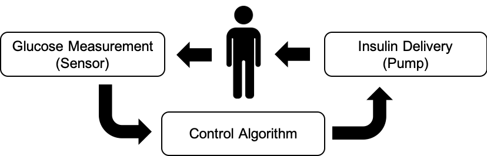

<h1>Reinforcement Learning based Artificial Pancreas Systems.</h1>

Introduction
--
Design algorithms (agents / controllers) to control blood gluocse levels in people with Type 1 Diabetes (T1D). Optimal insulin range is 70-180 mg/dL. The dynamics of the glucoregulatory system is diverse among different T1D subjects and also across different age groups. Hence the accuracy of the agents need to be evaluated on all subjects.  




Contributions
-- 
* Formulate the problem as a continuing continous control problem in an POMDP environemnt. Eliminate the requirement of carbohydrate estimation aiming to reduce the cognitive burden. [Paper-Link]<br>
* Propose clinically inspired action translation functions for efficient learning. [Paper-Link]<br>
* RL algorithm G2P2C: Glucose Control by Glucose Prediction and Planning. [Paper-Link] 

Using the project
--

<h4>Installation</h4>
* Clone the repository.<br>
* Create a .env file and provide the path to the project.<br>

<h4>Prerequsites</h4>
Install simglucose v0.2.1: https://github.com/jxx123/simglucose which is an open source version of the UVA/Padova 2008 simulator approved by the FDA (Recommended to install using <code>pip install -e .</code>). The simulation environment and scenarios used in this project are extended from the original environment.

<h4>Quick Start</h4>

Running a PPO algorithm for glucose control.
```
cd experiments 
python run_RL_agent.py --agent ppo --folder_id test --patient_id 0 --return_type average --action_type exponential --device cpu --seed 3 --debug 0
```

Running a clinical treatment strategy based on basal-bolus control.
```
cd experiments
python run_clinical_treatment.py --folder_id temp --carb_estimation_method real
```

Running the G2P2C (Glucose Control by Glucose Prediction & Planning)  algorithm.
```
cd experiments
python run_RL_agent.py --agent g2p2c --folder_id test --patient_id 0 --return_type average --action_type exponential --device cpu --seed 3 --debug 0
```


<h4>Running Experiments</h4>
* Setup the simulation environment and scenario. <br>
The parameters of the environment such as the meal protocol, sensor / pump hardware can be setup using the <code>/utils/options.py</code> file.
<br>

* **Run experiment**<br>
Set paramteres of the target agent in respective file e.g. <code>/agents/ppo/parameters.py</code><br>
Run experiment <code>python3 start.py --agent ppo</code>
<br>

* **Computational Requirements**<br>
Computation requirements vary based on the type of Agent (PPO, G2PC, G2P2C), training interactions, and software versions.
<br>
On a NVIDIA 3090(24GB) GPU with CUDA Version 11.4, Driver Version: 470.103.01, pytorch 1.8.2+cu111, python 3.8.10: 12 Experiments can be packed in a single run. 4.5GB CPU Memory required for each experiment. One experiment is defined as: glucose control learning for 1 subject, 1 seed. 
<br>
On NCI computational requirements for 1M interactions (python3/3.9.2 cuda/11.2.2)<br>
**PPO**: Walltime-approx 12hrs, nCPU-12, 1 GPU, Memory 8GB <br>
**G2P2C**: Walltime-approx 28hrs, nCPU-12, 1 GPU, Memory 8GB<br>

<h4>Project Folder Structure</h4>
<pre>
sys_control
|- agents: control scripts (e.g.pid, mpc, rl)
|  |- ppo (an example agent)
|  |  |- core.py
|  |  |- parameters.py
|  |  |- models.py
|  |  |- worker.py
|  |  |- ppo.py
|- environment: The simglucose environment. (Not a must simglucose can be install anywhere)
|- experiments: Folder where experiments are carried out.
|- utils: scripts for common functions across experiments.
|- results: experiment results will be saved here in seperate folders
|- visualiser: to visualise / debug agent training using jupyter notebooks
</pre>

The output of an experiment will be saved in <code>/results</code> under the given folder name.<br>

<pre>
Root (Folder Name i.e. Experiment Name)
|- checkpoint
|- code
|- testing
|  |- data
|  |- graphs
|- training
|  |- data
|  |- graphs
|- args.json
|- debug.log
|- explained_var.csv
</pre>

<h4>Visualizing Results</h4>
A plotting library is developed to plot the glucose, insulin, and meal fluctuations of a simulation. Jupyter notebooks are used for the visualisations where ready made scripts available to analyse the results on individual / cohort levels and conduct statistical tests.
* Jupyter notebook scripts have been included to visualize the results
* individual_analyzer: plot learning curves for an individual T1D subject (3 random seeds).
* cohort_analyzer: plot aggregate results for a given T1D cohort / protocol / agent; stats / metrics for the cohort. 
* compare_agents: compare agents (e.g., ppo, g2p2c) in an individual T1D subject level.


Citing Our Work
### Citing
```
@article{hettiarachchi2022_G2P2C,
title={G2P2C: A Deep Reinforcement Learning Algorithm for Glucose Control by Glucose Prediction and Planning in Type 1 Diabetes},
author={Hettiarachchi, Chirath and Malagutti, Nicolo and Nolan,  Christopher and Suominen, Hanna and Daskalaki, Eleni},,
year={2022},
journal={Journal of Artificial Intelligence in Medicine preprint <link>},
}
```
```
@article{hettiarachchi2022_actionspace,
title={Non-linear Continuous Action Spaces for Reinforcement Learning in Type 1 Diabetes},
author={Hettiarachchi, Chirath and Malagutti, Nicolo and Nolan, Christopher and Suominen, Hanna and Daskalaki, Eleni},
year={2022},
journal={Australasian Joint Conference on Artificial Intelligence (accapted/in-press)},
}
```
```
@inproceedings{hettiarachchi2022reinforcement,
  title={A Reinforcement Learning Based System for Blood Glucose Control without Carbohydrate Estimation in Type 1 Diabetes: In Silico Validation},
  author={Hettiarachchi, Chirath and Malagutti, Nicolo and Nolan, Christopher and Daskalaki, Eleni and Suominen, Hanna},
  booktitle={2022 44th Annual International Conference of the IEEE Engineering in Medicine \& Biology Society (EMBC)},
  pages={950--956},
  year={2022},
  organization={IEEE}
}
```

Contact Us
--
Chirath Hettiarachchi - chirath.hettiarachchi@anu.edu.au
School of Computing, College of Engineering & Computer Science,
Australian National University. 

