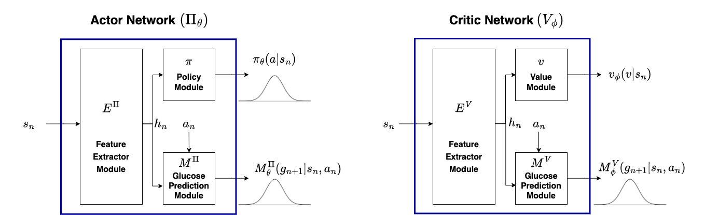
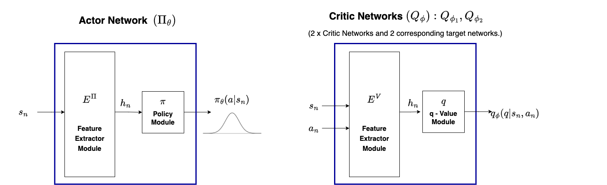

<h1>Short Notes: Implemented RL Algorithms</h1>

The glucose regulation task is formulated as a continuous control problem. <br>

The <b>Standard RL objective</b>: Maximise the expected sum of rewards (return - $`G(\tau)`$), following a policy $`\pi`$ (The policy induces a value function $`v^{\pi}(s_{t}) \doteq {E} [G_{t} | s_{t}]`$). <br>
```math
J(\pi) \doteq \sum_{t} E_{s_{t}, a_{t} \sim\pi_{\theta}}\bigg[r_{t}(s_{t}, a_{t})\bigg] = E_{\tau \sim\pi_{\theta}} \bigg[ G(\tau) \bigg]. 
```
You can calculate the return using either: <br>  
(1) discounted-RL setting (<code>--return_type discount</code>): 
```math
G_{t} \doteq R_{t+1} + \gamma R_{t+2} + \gamma^{2}R_{t+3} + \cdots  = \sum_{k=0}^{\infty} \bigg[\gamma^{k}R_{t+k+1} \bigg], \gamma \in [0,1]
```
```math
\hat{G_{t}} =R_{t+1} + \gamma R_{t+2} + \gamma^{2}R_{t+3} + \cdots  + \gamma^{t+n-1}\hat{v}^{\pi}(s_{t+n}).
```

(2) Average-Reward-RL setting (<code>--return_type average</code>):
```math
G_{t} \doteq R_{t+1} - r(\pi) + R_{t+2} - r(\pi) + R_{t+3} - r(\pi) + \cdots .
```
```math
r(\pi) \doteq \lim_{h \to \infty}\frac{1}{h}\sum_{t=1}^{h} \mathbb{E}[R_{t}|S_{0}, A_{0:t-1}\sim\pi].
```
```math
\hat{G_{t}} = R_{t+1} - r(\pi) + R_{t+2} - r(\pi) + R_{t+3} - r(\pi) + \cdots + R_{t+n} - r(\pi)  + \hat{v}^{\pi}(s_{t+n}).
```
then the advantage function is, <br>
```math
A^{\pi}(s_{t}, a_{t}) \doteq G_{t} - v^{\pi}(s_{t}).
```
The <b>The Maximum Entropy RL Objective</b> (used in the SAC algorithm where the discounted setting is used to calculate the returns).
```math
J(\pi) \doteq \sum_{t=1}^{\infty} E_{s_{0}, a_{0:t-1}\sim\pi} \Bigg[\bigg(r_{t} + \alpha H\bigg(\pi(\cdot|s_{t})\bigg) \Bigg].
```


<h2>A2C - Advantage Actor Critic</h2>


```math
L^{\pi}_{A2C}(\theta) = \hat{E}_{t}\Bigg[ log \pi_{\theta}(a_{t}|s_{t}) \hat{A}_{t} + \beta_{s}H \bigg(\pi(\cdot|s_{t}) \bigg) \Bigg].
```

```math
L^{v}(\phi) = \hat{E}_{t}\left[\frac{1}{2} \Bigg(v_{\phi}(s_{t}) - \hat{v}_{t}^{target} \Bigg)^{2}\right].
```
Reference:
```
@inproceedings{mnih2016asynchronous,
  title={{Asynchronous Methods for Deep Reinforcement Learning}},
  author={Mnih, Volodymyr and Badia, Adria Puigdomenech and Mirza, Mehdi and Graves, Alex and Lillicrap, Timothy and Harley, Tim and Silver, David and Kavukcuoglu, Koray},
  booktitle={33\textsuperscript{rd} International Conference on Machine Learning},
  pages={Proceedings (Vol. 48, Pp. 1928--1937)},
  year={2016},
  organization={PMLR},
}
```

<h2>PPO - Proximal Policy Optimisation</h2>


```math
L^{\pi}_{PPO}(\theta) = \hat{E}_{t}\Bigg[ \Bigg. min \Bigg(\frac{\pi_{\theta}(a_{t}|s_{t})}{\pi_{\theta_{old}}(a_{t}|s_{t})}\hat{A}_{t}, clip \bigg(\frac{\pi_{\theta}(a_{t}|s_{t})}{\pi_{\theta_{old}}(a_{t}|s_{t})}, 1-\epsilon, 1+\epsilon \bigg)\hat{A}_{t} \Bigg) + \beta_{s}H \bigg(\pi(\cdot|s_{t}) \bigg)\Bigg. \Bigg].
```

```math
L^{v}(\phi) = \hat{E}_{t}\left[\frac{1}{2} \Bigg(v_{\phi}(s_{t}) - \hat{v}_{t}^{target} \Bigg)^{2}\right].
```

Reference:
```
@article{schulman2017proximal,
  title={{Proximal Policy Optimization Algorithms}},
  author={Schulman, John and Wolski, Filip and Dhariwal, Prafulla and Radford, Alec and Klimov, Oleg},
  journal={arXiv:1707.06347},
  year={2017},
  doi={https://doi.org/10.48550/arXiv.1707.06347}
```

<h2>G2P2C - Glucose Control by Glucose Prediction & Planning</h2>



Consists of 3 optimisation phases, the first phase is similar to **PPO**.<br>
Model Learning Phase <br>
```math
L^{M^{\Pi}}(\theta) = \hat{E}_{t}\Bigg[ \Bigg. -log \bigg(M^{\Pi}_{\theta}(g_{t+1}|s_{t}, a_{t}) \bigg) + \beta_{1}d_{KL} \bigg[\pi_{\theta_{ppo}}(\cdot|s_{t}), \pi_{\theta}(\cdot|s_{t}) \bigg]\Bigg. \Bigg].
```
```math
L^{M^{V}}(\phi) = \hat{E}_{t}\Bigg[ \Bigg. -log \bigg(M^{V}_{\phi}(g_{t+1}|s_{t}, a_{t}) \bigg) + \beta_{2}\frac{1}{2} \bigg(v_{\phi_{ppo}}(s_{t}) - \hat{v}_{\phi}(s_{t}) \bigg)^{2}\Bigg. \Bigg].
```
Planning Phase <br>
```math
\tau^{*} = \arg \max_{\tau}\Bigg[ \Bigg. (\sum_{q=1}^{n_{plan}}R_{q}) + v(s_{n_{plan}})\Bigg].
```
```math
L^{plan}(\theta) = \hat{E}_{t}\Bigg[ \Bigg. -log \bigg(\pi_{\theta}(a^{*}_{t}|s_{t}) \bigg)\Bigg].
```
Reference:
```
@article{hettiarachchi2024g2p2c,
  title={G2P2C—A modular reinforcement learning algorithm for glucose control by glucose prediction and planning in Type 1 Diabetes},
  author={Hettiarachchi, Chirath and Malagutti, Nicolo and Nolan, Christopher J and Suominen, Hanna and Daskalaki, Elena},
  journal={Biomedical Signal Processing and Control},
  volume={90},
  pages={105839},
  year={2024},
  publisher={Elsevier}
}
```

<h2>SAC - Soft Actor Critic</h2>



```math
L^{Q}_{SAC}(\phi_{j}) = \hat{E}_{t}\left[\frac{1}{2} \Bigg(Q_{\phi_{j}}(s_{t}) - \hat{Q}_{t}^{target} \Bigg)^{2}\right] \text{for } j \in \{1,2\}.
```

```math
\bar{\phi_{j}} = \tau \phi_{j} + (1-\tau) \bar{\phi_{j}} \text{ for } j \in \{1,2\}.
```

```math
L^{\pi}_{SAC}(\theta) = \hat{E}_{t}\Bigg[ \alpha log(\pi_{\theta}(a_{t}|s_{t})) - Q_{\phi}(s_{t}, a_{t}) \Bigg].
```

```math
L^{\alpha}_{SAC}(\alpha) = \hat{E}_{t}\Bigg[ -\alpha log \pi_{t}(a_{t}|s_{t}) - \alpha \bar{H} \Bigg].
```
Reference:
```
@article{haarnoja2018soft,
  title={Soft actor-critic algorithms and applications},
  author={Haarnoja, Tuomas and Zhou, Aurick and Hartikainen, Kristian and Tucker, George and Ha, Sehoon and Tan, Jie and Kumar, Vikash and Zhu, Henry and Gupta, Abhishek and Abbeel, Pieter and others},
  journal={arXiv preprint arXiv:1812.05905},
  year={2018}
}
```


